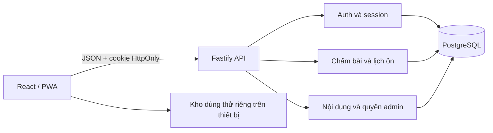

# Kiến trúc 3.0

Frontend/backend tách trách nhiệm; dùng chung hàm thuần trong `shared`. Trình duyệt gửi đáp án, loại bài, gợi ý và mã lượt luyện. Backend tính điểm/ngày theo múi giờ tài khoản, cập nhật mức nhớ trong transaction. SQL DATE giữ dạng YYYY-MM-DD, không chuyển qua timestamp/múi giờ server.

## Dữ liệu và quyền

`users`, `sessions`, `learner_settings` quản lý danh tính/thiết lập. `topics`, `phrases`, `scenarios` lưu nội dung. `phrase_progress`, `attempts`, `daily_activity`, `bookmarks`, `personal_notes`, `scenario_attempts` tách tiến độ, có khóa ngoại và chỉ mục. `audit_log` ghi thay đổi nội dung và khôi phục.

Truy vấn cá nhân dùng user ID từ session xác thực. SQL có tham số. Xóa user cascade dữ liệu cá nhân. Mật khẩu scrypt có salt; chỉ lưu hash session/mã khôi phục. Không ghi cookie, mật khẩu hoặc đáp án vào request log.

Khóa hàng `learner_settings FOR UPDATE` tuần tự hóa thay đổi theo tài khoản. Unique `(user_id,event_key)` chống ghi trùng khi retry; key trùng với đáp án khác trả 409. Snapshot gồm revision và nhiều bảng được đọc dưới cùng khóa, tránh revision mới đi cùng dữ liệu cũ. Chấm bài chỉ đọc trạng thái câu đang học; client nhận snapshot sau commit.

## Đồng bộ và offline

React giữ tiến độ tài khoản trong bộ nhớ, tuần tự request, chỉ áp dụng revision không cũ hơn phiên hiện tại. Đăng xuất quay lại kho dùng thử riêng. Đổi tài khoản xóa snapshot trước khi tải tài khoản mới. API không được service worker cache. Nội dung công khai có ETag/cache; admin sửa theo revision để chống ghi đè ngoài ý muốn.

Không có tự đồng bộ bài làm tài khoản khi ngoại tuyến. Request thất bại giữ bài hiện tại và cho retry cùng event key. Import chỉ khôi phục đã xem/ghi chú/lưu câu; không cấp mức nhớ đã xác minh.

## Mở rộng

Có thể thêm billing, thông báo hoặc đánh giá ngôn ngữ thành module backend, gắn vào user ID hiện có. Chưa cần microservices. PostgreSQL và API độc lập với React, có thể đặt sau reverse proxy/gateway. Nhiều replicas cần rate limit chung, tổng connection budget, theo dõi latency, query plan, phân trang và load test. Kiến trúc hỗ trợ phát triển tiếp; chưa có bằng chứng chịu tải lớn.
